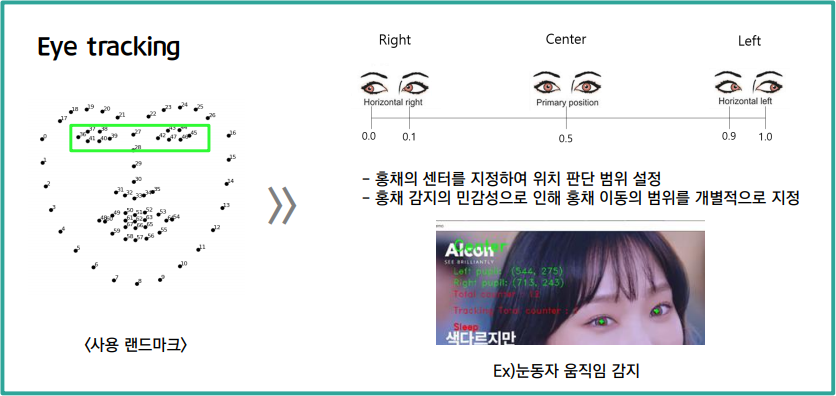
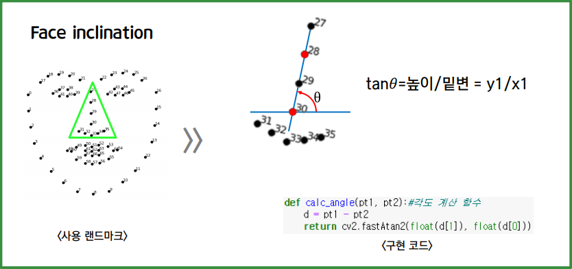

# 졸음 판별기
## 프로젝트 계획 배경
> - COVID19로 인한 온라인 비대면 교육의 증가,
> 낯선 교육 환경으로 인한 학습 집중도 감소 우려
> - 비대면 학습의 성취도 함양을 위한 학습 보조 자료 제공
## 프로젝트 요구사항
> - OpenCV를 활용한 얼굴인식
> - 수업집중율 감지(졸음, 시선분산 등)
> - 수업 집중 횟수, 집중율 등 피드백 데이터 제공

## 사용 기술
- dlib
- opencv
- 랜드마크
## 기능 설명
### 1. Eye tracking

### 2. Eye Blink Detection

### 3. Face inclination

